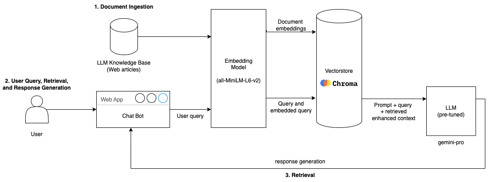

# 📚 Notegen: Customized Notes Generation ✨ - [Demo Video](https://www.youtube.com/watch?v=k_jEBhGScaA&feature=youtu.be&themeRefresh=1)

Notegen is an innovative AI-powered application that generates comprehensive notes based on user-defined topics and structures. By leveraging pools of data and a custom table of contents, Notegen creates tailored, in-depth content for various purposes such as research papers, reports, or study materials.

## 🚀 Features

- 📄 Upload custom text files as knowledge base
- 🗂️ Define your own table of contents
- 🤖 AI-powered content generation
- 📝 Markdown-formatted output
- 💾 Download generated content

## 🏗️ System Architecture

## 🚦 Getting Started

1. Clone the repository
2. Install dependencies: `pip install -r requirements.txt`
3. Set up your Google API key in a `.env` file
4. Run the app: `streamlit run app.py`

Happy note-taking! 📝🎉
